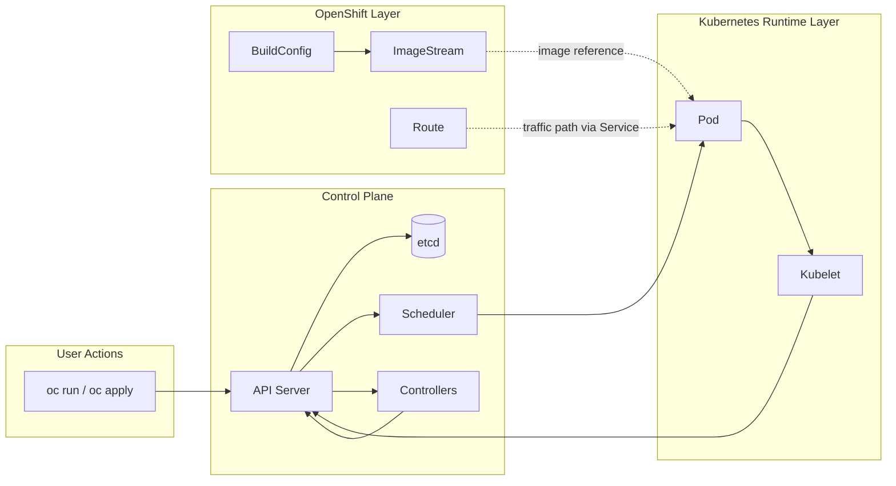

# Diagram 02: Pod Lifecycle and Control Plane Flow

Arrow meanings:

- `User -> API Server`: user submits desired state changes.
- `API Server -> etcd`: cluster state is persisted.
- `API Server -> Scheduler`: unscheduled Pods are evaluated for placement.
- `Scheduler -> Pod`: node binding decision is written.
- `Pod -> Kubelet`: node agent receives desired Pod workload.
- `Kubelet -> API Server`: status and events are reported back.
- `Controllers <-> API Server`: controllers watch objects and reconcile drift.
- `BuildConfig -> ImageStream`: OpenShift build output is tracked by tag.
- `ImageStream -> Pod`: runtime can consume tracked image versions.
- `Route -> Pod`: external traffic reaches workloads through routing and service mapping.

Troubleshooting focus:

- If Pod is not running, inspect API object status, events, and kubelet-related messages.
- If image pull fails, validate image source/tag and compare with ImageStream or registry reference.
- If Pod is missing, verify project context and query across namespaces.
