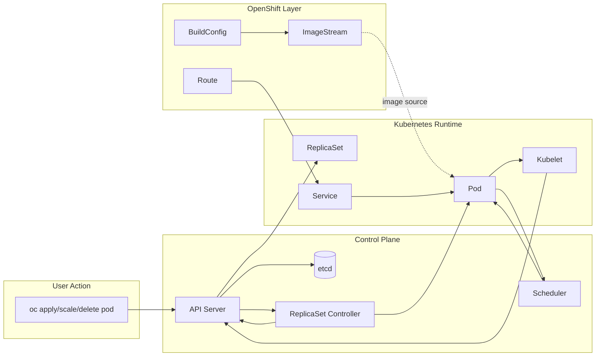

# Diagram 03: ReplicaSet Reconciliation Flow

Arrow meanings:

- `User -> API Server`: desired-state change request is submitted.
- `API Server -> etcd`: object state is persisted.
- `API Server -> ReplicaSet`: declared ReplicaSet spec is stored and served.
- `API Server <-> ReplicaSet Controller`: controller watches objects and posts updates.
- `ReplicaSet Controller -> Pod`: creates/replaces Pods to match desired count.
- `Pod -> Scheduler`: unscheduled Pod is evaluated for placement.
- `Scheduler -> Pod`: binding decision assigns Pod to node.
- `Pod -> Kubelet`: kubelet executes node-local container lifecycle.
- `Kubelet -> API Server`: Pod status and events are reported.
- `BuildConfig -> ImageStream`: build outputs are tracked by image tags.
- `ImageStream -> Pod`: runtime image references can originate from ImageStreams.
- `Route -> Service -> Pod`: external traffic flow chain in OpenShift.

Troubleshooting focus:

- If Pod count is wrong, inspect ReplicaSet desired/current values and selector alignment.
- If Pods are recreated unexpectedly, check controller reconciliation and ownership.
- If resources appear missing, confirm active project and query all namespaces.
