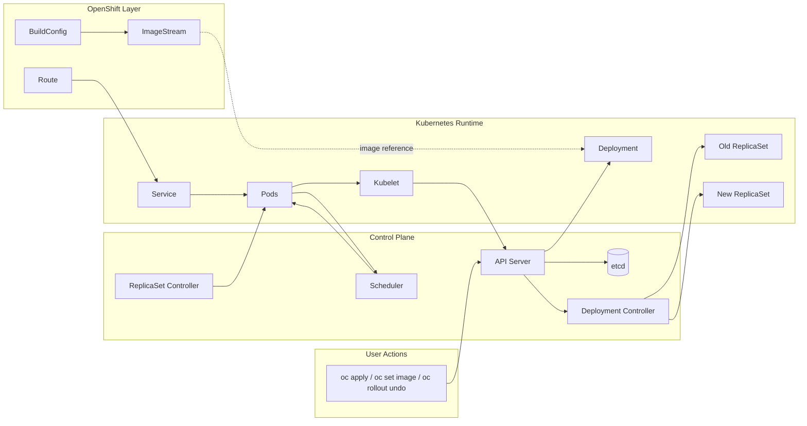

# Diagram 04: Deployment Rolling Update and Rollback

Arrow meanings:

- `User -> API Server`: rollout intent is submitted.
- `API Server -> etcd`: deployment and revision state is persisted.
- `API Server -> Deployment`: desired deployment spec is stored and served.
- `API Server -> Deployment Controller`: controller receives updated desired state via watches.
- `Deployment Controller -> Old/New ReplicaSet`: controller scales old and new revisions per strategy.
- `ReplicaSet Controller -> Pods`: each ReplicaSet reconciles its Pod count.
- `Pods -> Scheduler`: unscheduled Pods enter scheduling queue.
- `Scheduler -> Pods`: node binding assignment is written.
- `Pods -> Kubelet`: node agent starts and monitors containers.
- `Kubelet -> API Server`: runtime status and events are reported.
- `BuildConfig -> ImageStream`: build outputs tracked in OpenShift.
- `ImageStream -> Deployment`: deployment image may be sourced from tracked image tags.
- `Route -> Service -> Pods`: external request path to active application pods.

Troubleshooting focus:

- If rollout stalls, inspect Deployment conditions, ReplicaSet counts, and Pod events.
- If bad image breaks rollout, identify failing revision and rollback.
- If resources appear absent, validate project context and query all namespaces.
