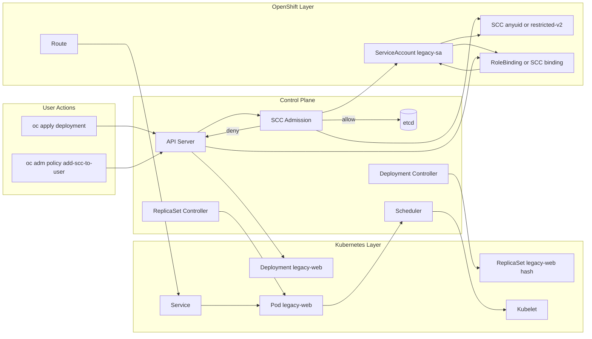

# Diagram 05: SCC Admission Flow and Reconciliation

Arrow meanings:

- `User -> API Server`: user submits desired state or policy change.
- `API Server -> SCC Admission`: pod requests are evaluated before persistence.
- `SCC Admission -> SCC`: policy rules are checked against pod security context.
- `SCC Admission -> ServiceAccount`: admission uses SA identity and permissions.
- `ServiceAccount -> Binding`: bindings determine which SCCs are usable.
- `Admission allow -> etcd`: accepted objects are persisted as cluster truth.
- `Admission deny -> API Server response`: rejected pod creation returns forbidden events.
- `API Server -> Deployment`: deployment object is stored and watched by controllers.
- `Deployment Controller -> ReplicaSet`: controller computes desired revision and scale.
- `ReplicaSet Controller -> Pod`: pod creation is retried through reconciliation.
- `Pod -> Scheduler -> Kubelet`: scheduled pods are started and monitored on nodes.
- `Policy change path`: SCC grant updates authorization, then next reconcile succeeds.
- `Route -> Service -> Pod`: external traffic path after pod is admitted and running.
