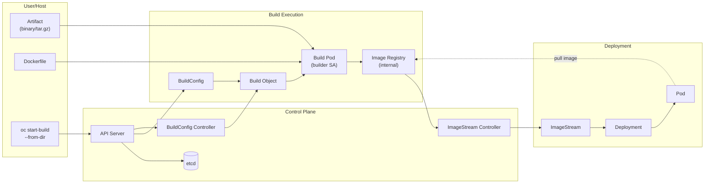

# Diagram 08: Binary Build Workflow and Registry Push



Arrow meanings:

- `User cmd -> API Server`: start-build request submitted.
- `API Server -> etcd`: BuildConfig and Build state persisted.
- `API Server -> BuildConfig Controller`: controller watches for new builds.
- `BuildConfig Controller -> Build`: controller creates Build object.
- `Build -> Build Pod`: controller creates pod in cluster.
- `Artifact/Dockerfile -> Build Pod`: inputs extracted into pod.
- `Build Pod -> Image Registry`: Docker build completes, image pushed to internal registry.
- `Image Registry -> ImageStream Controller`: push event triggers reconciliation.
- `ImageStream Controller -> ImageStream`: tags and digests updated.
- `ImageStream -> Deployment`: image reference resolved.
- `Deployment -> Pod`: replica created with image.
- `Pod → Registry (dashed)`: pod pulls image using service account credentials.

## Build Pod Lifecycle

```
Time           Status              Action
0              Pending             Created, awaiting node
5              Running             Extracting artifact
10             Running             Reading Dockerfile
15             Running             Docker build step
30             Running             Image build complete
35             Running             Pushing image to registry
40             Running             Push successful
45             Succeeded           Build pod terminates
```

## Key Interaction Points

1. **API Server** receives `oc start-build` and creates Build object in etcd.
2. **Build Controller** observes Build and creates a temporary pod.
3. **Build Pod** executes Dockerfile, embedding the pre-built artifact.
4. **Internal Registry** receives push request from build pod's service account.
5. **ImageStream Controller** observes new image and updates ImageStream status.
6. **Deployment** can now pull image by tag or digest from internal registry.
7. **Kubelet** on node pulls image using default ServiceAccount credentials.

## Why Binary Builds Matter for EX288

- Pre-compiled artifacts can be built outside the cluster (e.g., on your workstation).
- Useful when source code is not available or build chain is complex.
- Binary mode is faster than source builds (no cluster compilation).
- Demonstrates understanding of internal registry and ImageStream integration.
- Necessary for exam scenarios where you cannot rely on external Git access.
