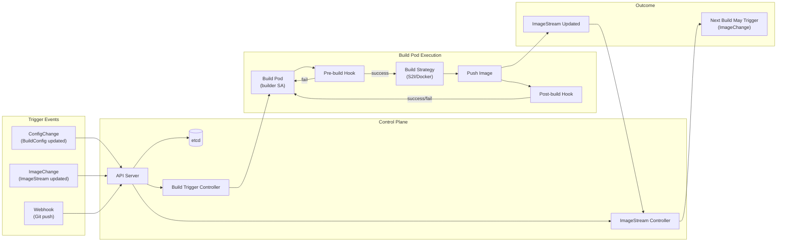

# Diagram 09: Build Triggers and Hooks Execution Flow



Arrow meanings:

- `Trigger Event -> API Server`: event (ConfigChange, ImageChange, webhook) submitted.
- `API Server -> etcd`: trigger state and new Build object persisted.
- `API Server -> Build Trigger Controller`: controller watches for trigger conditions.
- `Build Trigger Controller -> Build Pod`: new build pod created.
- `Build Pod -> Pre-build Hook`: hook executes at start of build.
- `Pre-build Hook success -> Build Strategy`: build continues if hook succeeds.
- `Pre-build Hook fail -> Build Pod`: build aborted if hook fails (exit non-zero).
- `Build Strategy -> Push Image`: image built and pushed to registry.
- `Push -> Post-build Hook`: hook executes after successful push.
- `Post-build Hook -> Build Pod`: hook runs to completion regardless of exit code.
- `Image Push -> ImageStream Updated`: ImageStream controller updates tags and digests.
- `ImageStream Update -> ImageChange Trigger`: dependent BuildConfigs with ImageChange trigger may fire.

## Build Lifecycle with Hooks

```
Time (s)   Event                          Logs/Status
0          Trigger fired                  ConfigChange/ImageChange/Webhook
5          Build object created           Build phase: Pending
10         Build pod scheduled            Build phase: Running
15         Pre-build hook starts          Hook output begins
20         Pre-build hook completes       Hook exit code checked
25         Build strategy starts          S2I/Docker output begins
60         Build strategy completes       Image built successfully
70         Image push to registry         Registry: push accepted
80         Post-build hook starts         Hook output begins
85         Post-build hook completes      Hook exit code checked (non-blocking)
90         Build complete                 Build phase: Complete/Failed
95         ImageStream updated            New image digest available
100        Next ImageChange trigger       Dependent BuildConfigs evaluated
```

## ConfigChange vs ImageChange Triggers

| Trigger      | Condition                             | Frequency                | Use Case                         |
| ------------ | ------------------------------------- | ------------------------ | -------------------------------- |
| ConfigChange | Any field in BuildConfig.spec changes | Fires once per change    | Re-build when config updated     |
| ImageChange  | Referenced ImageStream tag is updated | Fires on each tag update | Re-build when base image updated |

## Key Interaction Points

1. **API Server** receives trigger event and persists Build object.
2. **Build Controller** observes Build and schedules build pod.
3. **Build Pod** executes pre-build hook—if fails, build aborts.
4. **Build Pod** executes build strategy (S2I or Docker).
5. **Build Pod** pushes image to internal registry.
6. **ImageStream Controller** observes push and updates ImageStream.
7. **Build Trigger Controller** evaluates dependent BuildConfigs for ImageChange triggers.
8. **Post-build Hook** executes asynchronously (failure is logged but non-blocking).

## EX288 Relevance

- Build automation reduces manual intervention during exam scenarios.
- Triggers can chain builds (Git push → build → deploy).
- Hooks allow custom validation and integration (tests, notifications).
- Understanding trigger evaluation explains build reconciliation loops.
