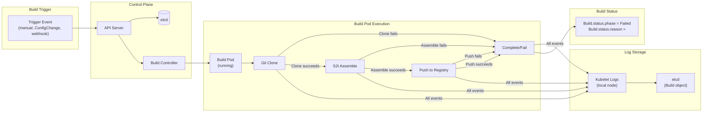
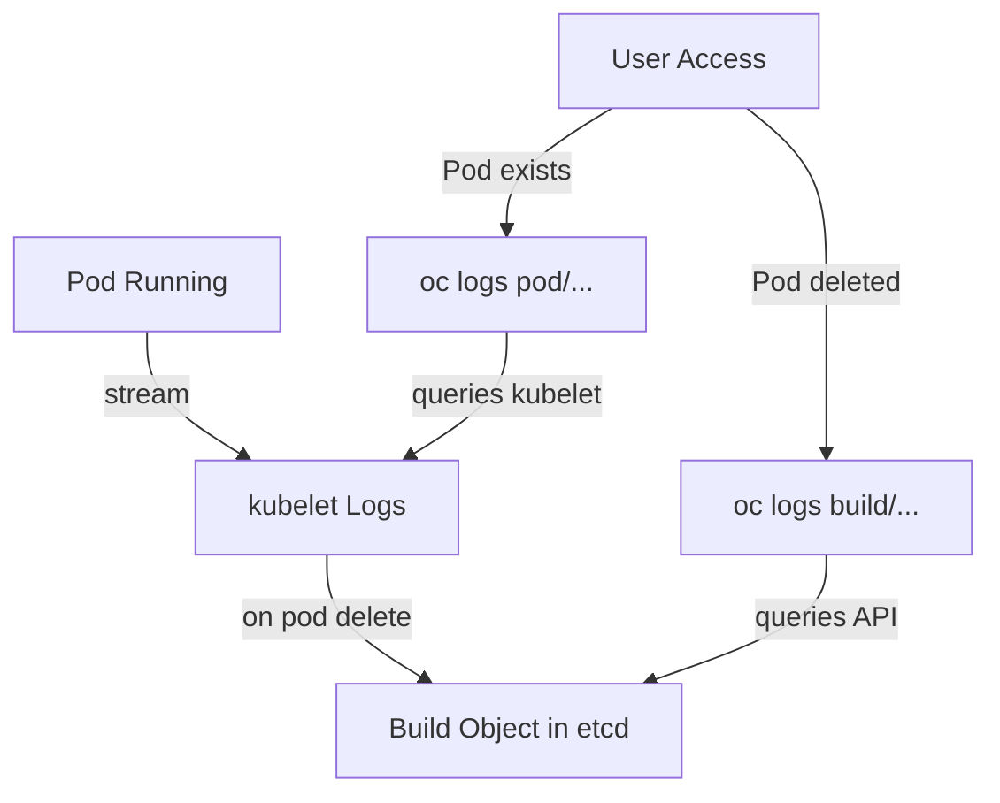

# Diagram 10: Build Troubleshooting Flow



Arrow meanings:

- `Trigger Event -> API Server`: Build request submitted.
- `API Server -> etcd`: Build object created, initial status Pending.
- `API Server -> Build Controller`: Controller watches Build, schedules pod.
- `Build Controller -> Build Pod`: Pod created and started.
- `Build Pod -> Git Clone`: Clone from Git repository.
- `Clone fails -> Complete/Fail`: Build aborts, status set to Failed.
- `Clone succeeds -> S2I Assemble`: Build continues to next step.
- `Assemble fails -> Complete/Fail`: Build fails during assemble.
- `Assemble succeeds -> Push`: Image built, push to registry.
- `Push fails -> Complete/Fail`: Build fails during push.
- `Push succeeds -> Complete/Fail`: Build completes successfully.
- `All events -> Kubelet Logs`: All logs streamed to node local storage.
- `Kubelet Logs -> etcd`: Build object updated with final logs and reason.
- `Complete/Fail -> Build Status`: Build object status updated (phase, reason, conditions).

## Build Failure Detection and Recovery

```
Time    Event                      Build Pod State          Build.status        Action
0       Build triggered            Pending                  Pending              Poll API
5       Pod scheduled              Pending                  Running              Watch pod
10      Pod starts                 Running (setup)          Running              Monitor logs
15      Git clone starts           Running (clone)          Running              Capture logs
20      Clone fails                Failed                   Failed               Update reason
25      Pod terminates             Failed/Completed         Failed               Kubelet saves logs
30      Logs available             Pod deleted              Failed+Reason+Log    User can access via `oc logs build/...`

Failure is detected and persisted in etcd; logs survive pod deletion.
```

## Common Failure Points and Diagnostics

| Step | Failure Point | Error Message                 | Diagnosis Command                       |
| ---- | ------------- | ----------------------------- | --------------------------------------- |
| 1    | Git Clone     | "fatal: unable to access"     | `oc logs build/<name>`                  |
| 2    | S2I Assemble  | "assemble: command not found" | `oc logs build/<name> \| grep assemble` |
| 3    | Push          | "denied: access forbidden"    | `oc describe pod <pod>` + check SA      |
| 4    | Resource      | "quota exceeded"              | `oc describe project`                   |
| 5    | Image Pull    | "ImagePullBackOff"            | `oc describe pod <pod>`                 |

## Log Access After Pod Deletion



## EX288 Relevance

- Build troubleshooting is a core skill for exam scenarios.
- Ability to diagnose failures quickly using only CLI separates expert from novice.
- Understanding log persistence (kubelet + etcd) explains why `oc logs build/...` works even after pod cleanup.
- Practice with intentional failures builds confidence for realistic exam scenarios.

## Key Internals

1. **Build Pod Logs** → Captured by kubelet on the node where pod runs.
2. **Log Persistence** → Logs copied to Build object in etcd when pod terminates.
3. **Access Path** → `oc logs build/<name>` queries Build object from etcd, not pod.
4. **Failure Reason** → Stored in Build.status.reason and correlates to last log line before pod termination.
5. **Event Tracking** → API Server records each step (clone, assemble, push) via Events; useful for timeline reconstruction.
