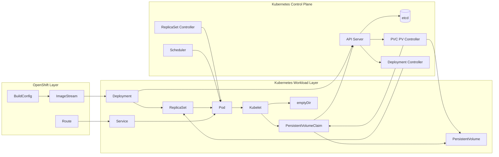
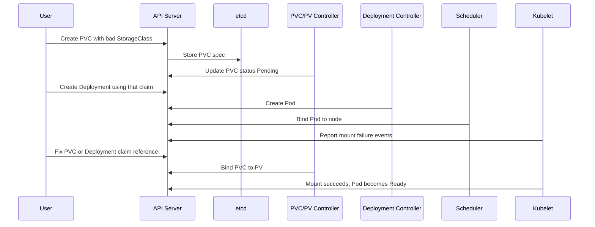

# Diagram 14: Volumes and PVC Lifecycle

Arrow meanings:

- `BuildConfig -> ImageStream`: Build process publishes app image tags.
- `ImageStream -> Deployment`: Deployment can consume tracked image versions.
- `Deployment -> ReplicaSet -> Pod`: Controllers create and maintain running Pods.
- `Service -> Pod`: Service selects Pods for stable internal networking.
- `Route -> Service`: Route exposes the Service externally.
- `Deployment/PVC -> API Server`: Desired state is submitted to the control plane.
- `API Server -> etcd`: Desired and observed state is persisted.
- `API Server -> Controllers`: Controllers watch resources and reconcile.
- `PVC PV Controller -> PVC/PV`: Claim binding and dynamic provisioning logic.
- `Scheduler -> Pod`: Pod gets node assignment.
- `Pod -> Kubelet`: Node agent receives pod spec and enforces it.
- `Kubelet -> emptyDir/PVC`: Volumes are mounted before container start.
- `PVC -> PV`: Claim is satisfied by a concrete volume.

## Failure and Recovery Sequence

Arrow meanings:

- `User -> API Server`: Each oc command submits an API request.
- `API Server -> etcd`: Resource specs are persisted as source of truth.
- `PVC/PV Controller -> API Server`: Claim status transitions (Pending/Bound).
- `Deployment Controller -> API Server`: Pod creation for desired replicas.
- `Scheduler -> API Server`: Node binding decision is recorded.
- `Kubelet -> API Server`: Mount errors/success and pod condition updates.
- `User fix -> controllers`: Reconciliation loops apply corrected state until ready.