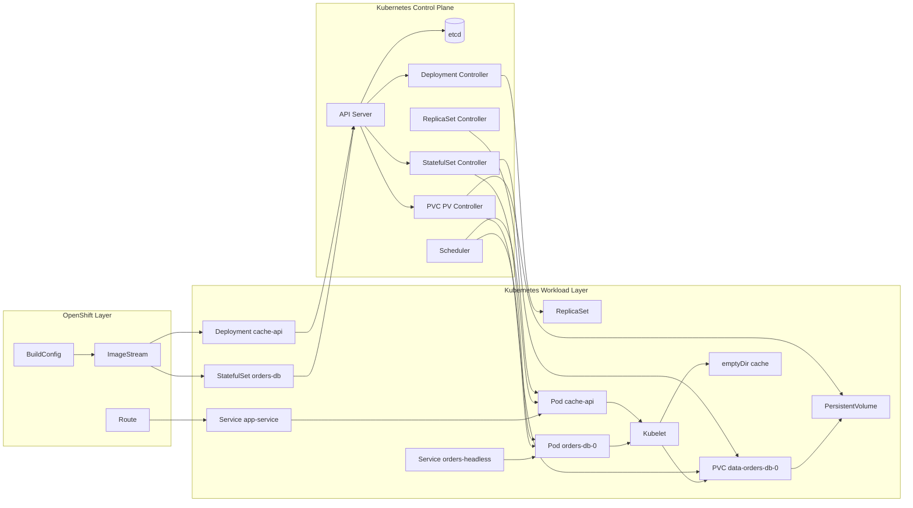
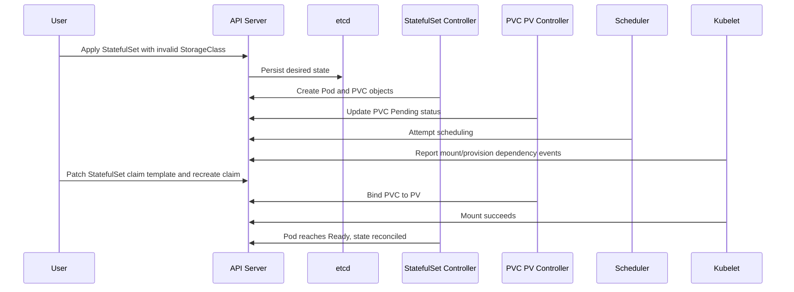

# Diagram 15: Storage Patterns and Controllers

Arrow meanings:

- `BuildConfig -> ImageStream`: Build pipeline publishes image versions.
- `ImageStream -> Deployment/StatefulSet`: Workloads consume tracked image tags.
- `Deployment/StatefulSet -> API Server`: Desired state is submitted.
- `API Server -> etcd`: State is persisted as control-plane source of truth.
- `API Server -> controllers`: Reconciliation loops are triggered by watch events.
- `Deployment Controller -> ReplicaSet -> Pod`: Stateless pod lifecycle management.
- `StatefulSet Controller -> Pod/PVC`: Stable identity and claim orchestration.
- `PVC/PV Controller -> PVC/PV`: Provisioning and binding operations.
- `Scheduler -> Pods`: Node placement decisions.
- `Kubelet -> emptyDir/PVC`: Node-side mount and runtime enforcement.
- `Service/Route chain`: Networking exposure independent from storage durability.

## Failure and Recovery Sequence

Arrow meanings:

- `User -> API Server`: Each CLI action submits a desired-state change.
- `API Server -> etcd`: Persisted definitions drive all reconciliation.
- `StatefulSet Controller -> API Server`: Pod/PVC generation for ordinal identity.
- `PVC/PV Controller -> API Server`: Claim lifecycle updates and binding status.
- `Scheduler/Kubelet -> API Server`: Placement plus node execution feedback.
- `Patch/fix path`: Controllers converge actual state back to desired state.