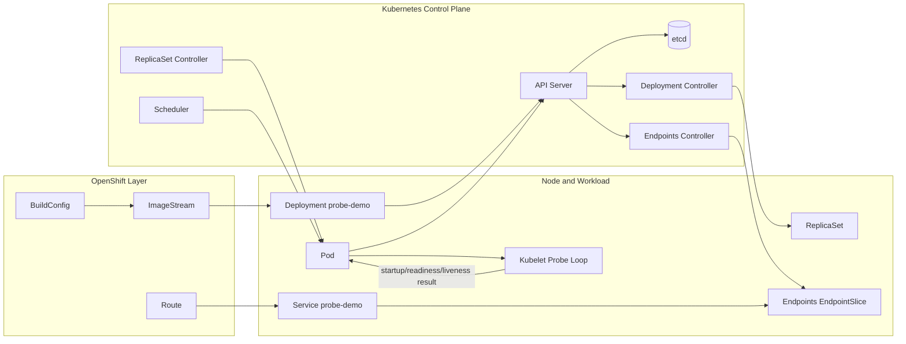
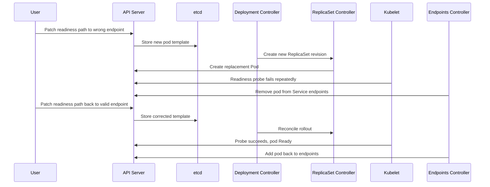

# Diagram 16: Probe Flow and Traffic Gating

Arrow meanings:

- `BuildConfig -> ImageStream`: build output updates image tracking.
- `ImageStream -> Deployment`: deployment consumes image revisions.
- `Deployment -> API Server`: desired probe specs are submitted.
- `API Server -> etcd`: desired and observed state is persisted.
- `API Server -> Deployment/ReplicaSet controllers`: pod reconciliation begins.
- `Scheduler -> Pod`: pod is assigned to a node.
- `Pod -> Kubelet`: kubelet runs container and executes probes.
- `Kubelet -> Pod`: probe results update readiness and restart behavior.
- `Pod/API/Endpoints controller`: readiness state drives endpoint membership.
- `Route -> Service -> Endpoints`: external traffic reaches only Ready pods.

## Failure and Recovery Sequence

Arrow meanings:

- `User -> API Server`: each oc patch changes desired state.
- `API Server -> etcd`: every revision is persisted.
- `Deployment/ReplicaSet controllers`: rollout and pod replacement happen by reconciliation.
- `Kubelet -> API Server`: probe outcomes update pod conditions and events.
- `Endpoints controller`: service traffic eligibility follows readiness state.