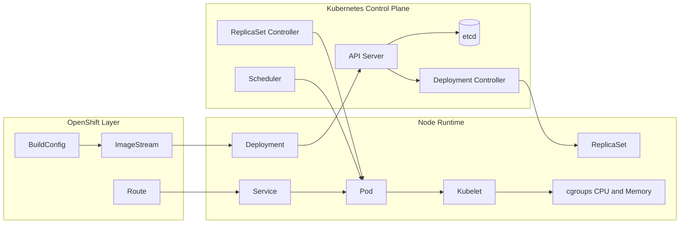
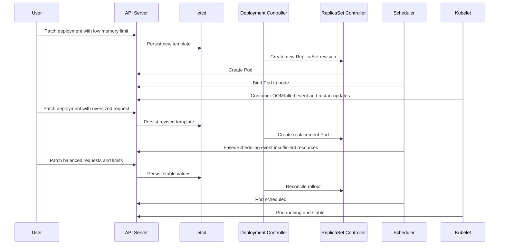

# Diagram 17: Resource Requests and Limits Flow

Arrow meanings:

- BuildConfig to ImageStream: build output versions are tracked.
- ImageStream to Deployment: deployment consumes image revisions.
- Deployment to API Server: desired resource requests and limits are submitted.
- API Server to etcd: desired and observed state is persisted.
- Deployment controller to ReplicaSet: rollout revision management.
- ReplicaSet controller to Pod: desired replica count is enforced.
- Scheduler to Pod: placement decision uses requests versus node allocatable resources.
- Pod to kubelet: node agent receives pod spec and lifecycle responsibility.
- Kubelet to cgroups: runtime CPU and memory limits are enforced.
- Service and Route path: traffic reaches pods that are running and ready.

## Failure and Recovery Sequence

Arrow meanings:

- User to API Server: each CLI action updates desired state.
- API Server to etcd: every spec/status transition is recorded.
- Deployment and ReplicaSet controllers: new revisions and pod replacement happen by reconciliation.
- Scheduler: admits or rejects pod placement based on requests.
- Kubelet: enforces runtime limits and reports OOM/restart outcomes.
- Final patch: corrected values allow stable convergence to desired state.